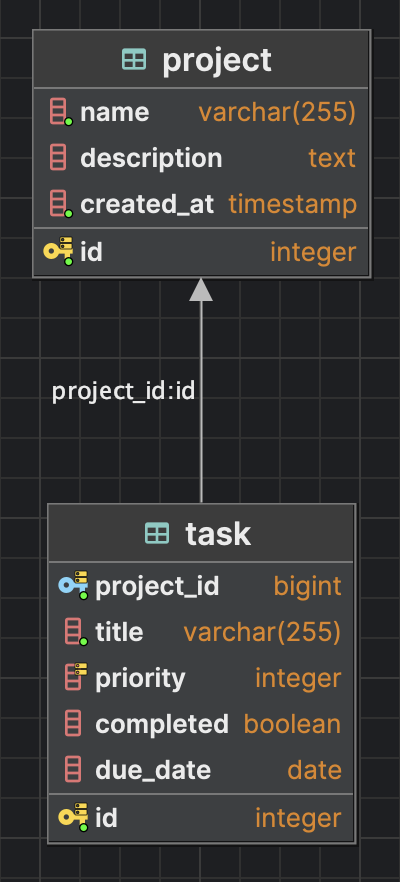

# FastAPI Code Challenge

**Challenge**: Build a Scalable FastAPI Backend Service with PostgreSQL Integration

- Use PostgreSQL for data persistence
- Design efficient schema with appropriate indexes (e.g., on project_id and priority).
- Write optimized queries to fetch tasks sorted by priority
- Use asynchronous endpoints and database calls (e.g., with asyncpg or databases library)
- Validate input data using Pydantic models
- Handle errors gracefully (e.g., 404 for not found, 400 for invalid input).
- Write clean, maintainable, and well-structured code

## Database Schema

Queries used to create the database schema can be found in `./sql` folder. 

### Tables

- `projects`: stores project information
- `tasks`: stores task information from projects

### Entity Relationship Diagram

## API Documentation

API documentation is available at `/docs` endpoint when the server is running.

## Setup

1. Clone the repository
2. Install dependencies with `pip install -r requirements.txt`
3. Set up PostgreSQL database and update the connection string in `.env`, using `.env-template` as a template
4. Run the server with `uvicorn app.main:app --reload`

